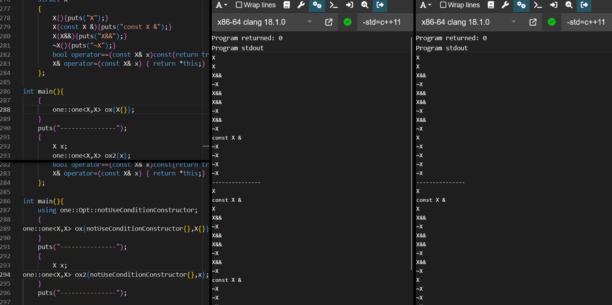

# one.h

This is a header-only C++ library that provides simple mutex locking and encapsulation, ensuring that only one instance of the same object with the same "condition" exists.  
Additionally:

- It follows the RAII principle.
- It is thread-safe.
- Cross-platform and dependency-free (only relies on the standard library).
- Being header-only, it's easy to customize.
- It adheres to modern C++ practices.

However, it also has some limitations:

- It cannot track instances where the library is not actively used.
- It can only guarantee uniqueness for instances with the same "condition" created using this library.

Look at these again:  

- [exec.h](https://github.com/moehoshio/exec.h)

In general, you'd want a file to be opened only once, especially in a multi-threaded scenario.  
  
This can be achieved:  

```cpp
using oneIo = one::one<std::fstream,std::string>;

void func(){
    try{
        oneIo file("file.txt");
        (*file.get())<<"hello file stream";
        std::this_thread::sleep_for(3000);
    }
}
void func2(){
    std::fstream file("file.txt");
    file<<"hello file stream";//potentially leading to unexpected outcomes.
}

    std::thread t1(func);// is ok
    std::thread t2(func);// throw ex

    //Direct usage would result in resource contention, potentially leading to unexpected outcomes.
    std::thread t3(func2);
    std::thread t4(func2);
```

## More usage example

```cpp
#include "one.h"
#include <fstream>
#include <string>
#include <iostream>
#include <filesystem>
using oneIo = one::one<std::fstream,std::string>;
//The first type of the template is the type of the object, followed by the 'conditions' (which can be more than one).
//e.g the one::one<std::fstream,std::string,std::ios::openmode, ...>
    try
    {
        // Here, the default object constructor is used.
        oneIo file(one::Opt::notUseConditionConstructor{},"file.txt");
        std::fstream * ioPtr = file.get();
        ioPtr->open("file.txt");
        *ioPtr<<"hello file stream";

        // Here, an object will be constructed using the condition ("file2.txt").
        oneIo file2("file2.txt");
        *file2.get()<<"hello file two";

        // Here, the condition "file3.txt" is evaluated, and then the object is constructed using {"file4.txt", std::ios::app}.
        oneIo file3(std::string("file3.txt"),"file4.txt",std::ios::app);
        *file3.get()<<"hello file four";

        // Here, only the reference is held, not the object itself. Using temporary objects may lead to dangling references!
        std::fstream o("file5.txt");
        oneIo file4(o,"file5.txt");
        (void)file4.get()->is_open();//true

        // If there are no identical "conditions" in the list, the maximum wait time to acquire the lock (defaulting to 5000 milliseconds):
        oneIo file5("file6.txt",std::chrono::milliseconds(1000));
        // Implicit conversion cannot be triggered here. (Template variable parameter matching takes precedence over implicit conversion)

        //throw using exception_ = type;
        oneIo file6("file.txt"); 
        
    } catch(const std::exception& e){
        // Handle errors...
    } catch (...){
        //The thrown exception type can be customized.
    }
    // The scope ends, releasing all its conditions.
    // If it's a custom type, it should adhere to the RAII principle. Otherwise, it must be released before the end of the scope.
    // std::fstream will automatically release (close) the file upon termination.
    oneIo file("file.txt");//is ok


```

You can also use a version with noexcept (i.e., default constructor and initialization through an init function):

```cpp
    oneIo file2;
    bool isOk = file2.init("file2.txt");
    if (isOk)
        //ok , do it
        (void)file2.get()->is_open();//true
    else
        //no , you can retry
        //this should not result in resource leaks.
        bool reTry = file2.init("file2.txt");
```

There's another version that allows direct access to member objects, holding members directly instead of pointers. Apart from that, they are almost identical.

```cpp
    one::oneR<std::fstream,std::string> file3(std::chrono::milliseconds(5000),/*condition*/"file3.txt","file3.txt");
    (void)file3.obj.is_open();//true
```

If you use different types, they will be different instances and lists (including one).

For example:

```cpp
// Here are different instances, which the list will consider as distinct.
one::oneR<std::fstream,std::filesystem::path> file4(one::Opt::notUseConditionConstructor{},std::filesystem::path("file3.txt"));
```

For type and conditions...

objects : new and delete should not be deleted.

condition : pointer types (including char *) should not be used.  
If it's a custom type, it should have T&&, operator ==, operator &&==  A satisfactory example is:

```cpp
    struct X{
        int i = 0;
        X(const X& x): i(x){}
        bool operator==(const X& x)const{return (i==x.i)? true : false ;}
        X& operator=(const X& x) { i = x.i; return *this;}
    };
```

Overhead:
For "condition", there will always be one copy.


Welcome to  submit questions, light up star , error corrections (even just for better translations), and feature suggestions/construction. :D
